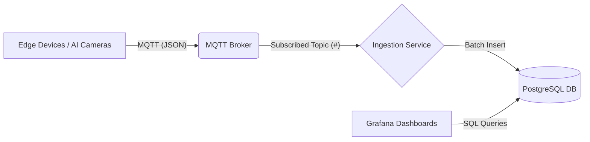

# System Architecture: Real-Time MQTT Ingestion & Visualization

## 1. High-Level Overview
The system is a real-time analytics pipeline designed to ingest high-frequency Alert/Event data from edge devices (Cameras, AI Sensors) via MQTT, store it efficiently in a relational database, and visualize it on live dashboards.

## 2. Core Components

### A. MQTT Broker (External)
-   **Role**: Central message hub.
-   **Address**: `103.205.115.74:1883`
-   **Protocol**: MQTT v3.1/5.0
-   **Data**: JSON payloads containing event details (ANPR, Crowd, etc.).

### B. Ingestion Service (Node.js)
-   **Role**: Consumes messages and writes to DB.
-   **Key Features**:
    -   **Batch Processing**: Buffers messages (e.g., 100ms or 50 items) to minimize DB round-trips.
    -   **Resilience**: Auto-reconnects to MQTT and DB. Retry logic for startup race conditions.
    -   **Optimization**: Removes heavy fields (e.g., `snapshot` base64 images) before storage to save space.
    -   **Packaging**: Compiled into a single `.exe` using `pkg` for dependency-free deployment.
    -   **Execution**: Runs as a background **Windows Service** (`MQTT_Ingestion_Service`) using `winsw`.

### C. Database (PostgreSQL)
-   **Role**: Persistent storage and query engine.
-   **Instance**: Standalone instance managed by the installer.
    -   **Port**: `5441` (to avoid conflict with default 5432).
    -   **Data Dir**: `./data` inside deployment folder.
-   **Schema**:
    -   **Table**: `mqtt_events`
    -   **Structure**:
        -   `id`: Serial (PK)
        -   `event_time`: Timestamp (Indexed for time-series queries)
        -   `event_type`: Text (Indexed for filtering)
        -   `payload`: **JSONB** (Binary JSON) - Allows flexible, schema-less storage of varying event datatypes.

### D. Visualization (Grafana)
-   **Role**: User Interface for analytics.
-   **Data Source**: PostgreSQL (`localhost:5441`).
-   **Dashboards**:
    -   **ANPR**: Traffic analysis, vehicle types, violations (No Helmet, Speeding).
    -   **Crowd**: Headcount trends, crowd density alerts.

---

## 3. Deployment Architecture ("The Installer")
To ensure the system works on any "fresh" machine, a custom deployment strategy was built.

### The `deploy/` Package
1.  **`setup.bat` (The Orchestrator)**:
    -   **Detection**: Scans the system (Program Files, existing pgAdmin paths) to find `initdb.exe` and `pg_ctl.exe`.
    -   **Provisioning**:
        -   Creates a *new* isolated PostgreSQL data directory in `./data`.
        -   Configures it to listen on **Port 5441**.
        -   Registers a new Windows Service: `PostgreSQL-5441`.
    -   **Installation**:
        -   Runs `setup_db.exe` to create the schema (includes retry logic for slow startups).
        -   Installs `MQTT_Ingestion_Service`.
2.  **`setup_db.exe`**:
    -   A compiled Node.js tool that connects to Postgres to create the `mqtt_alerts_db` database and run `init.sql`.

---

## 4. How It Works (Data Flow)
1.  **Event Trigger**: A camera detects a violation (e.g., "No Helmet").
2.  **Publish**: Camera publishes a JSON message to topic `Events/ANPR` on the Broker.
3.  **Ingest**:
    -   Ingestion Service receives the message.
    -   Strips the base64 `snapshot` image.
    -   Adds to the current memory batch.
4.  **Persist**: 
    -   Batch timer ticks. Service constructs a bulk `INSERT` query.
    -   Data is committed to `mqtt_events` table in PostgreSQL.
5.  **Visualize**:
    -   Grafana refreshes every 5s.
    -   Executes SQL: `SELECT count(*) FROM mqtt_events WHERE payload->>'NoHelmet' = 'True' ...`
    -   Dashboard updates with the new count.
