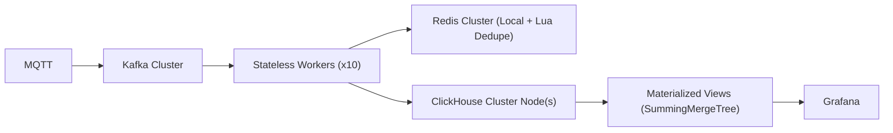

# 🧠 FINAL SYSTEM PURPOSE & BLUEPRINT (LOCKED)

**System:** A real-time, high-throughput, correctness-sensitive event processing system for crowd + traffic + surveillance analytics.

### 🎯 Core requirements
* 1335 cameras (VAS + ANPR)
* 5000/sec sustained, 10K/sec spike
* Near real-time dashboards (≤ 2–3 sec)
* No data loss
* No ingestion crash
* DR degraded survival

---

## 🧱 1. FINAL SYSTEM ARCHITECTURE

---

## ⚙️ 2. COMPONENT DESIGN RULES (DETAILED)

### 🔴 A. Kafka (INGESTION BUFFER)
* **Config:** 50–64 Partitions, RF=3, 24–48h Retention.
* **Partition Key:** `hash(camera_id + time_bucket)`
* **Hardware:** NVMe (1–2 TB), 8–16 CPU cores, 32–64 GB RAM.

### 🟡 B. Workers (PROCESSING LAYER)
* **Scaling:** 10–20 instance scaling. Go or Node.js. 
* **Internal flow:** Consume batch (1000) → Local dedupe → Redis Lua dedupe → Batch insert to CH.

### 🟢 C. Redis (DEDUPLICATION)
* **Setup:** Cluster (3 Master + 3 Replica).
* **Key format:** `dedupe:{camera_id}:{event_hash}`, TTL = 2–5 sec.
* **Requirements:** Local micro-batching -> Pipeline Lua scripts (`SETNX` atomicity).

### 🔵 D. ClickHouse (CORE DATABASE)
* **Hardware:** 3-5 shards, NVMe (2-4TB). 

**Rule: No raw queries for Dashboards.**
Raw Table (append-only) via `MergeTree`.
Aggregated Table via `SummingMergeTree` mapped to `Materialized View`.

---

## ⚠️ 3. FAILURE MODES & CATCHES

| Threat | Cause | Fix |
|---|---|---|
| **Kafka lag** | Workers slow | Scale workers horizontally + Monitor lag |
| **Redis overload** | Too many isolated requests | Lua batching + Local micro-dedupe first |
| **ClickHouse backlog** | Small inserts | Batch size strictly ≥ 1000 rows |
| **Grafana query storm**| Deep history aggregations | Only query `events_1min` Aggregated Views |
| **Worker crash** | OOM or Kernel kill | Kafka cooperative replay |

---

## 🚀 4. DEPLOYMENT PLAN (PHASES)

### Phase 1 — Stabilize Ingestion
* Deploy Kafka
* Route MQTT → Kafka
* Keep existing DB

### Phase 2 — Add Workers
* Build worker service
* Batch + dedupe logic
* Write direct to ClickHouse

### Phase 3 — Introduce ClickHouse
* Create schema (`MergeTree` + `SummingMergeTree` MVs)
* Verify ingestion speed
* Run parallel alongside Postgres

### Phase 4 — Switch Dashboards
* Grafana source rebind → ClickHouse
* Disable DB views in Postgres

### Phase 5 — Optimize & Load Test
* Tune batching and partitions
* Load test 10K/second spike simulation

---

> [!IMPORTANT]
> **This system is NOT forgiving. Discipline = survival. Carelessness = silent failure.**
